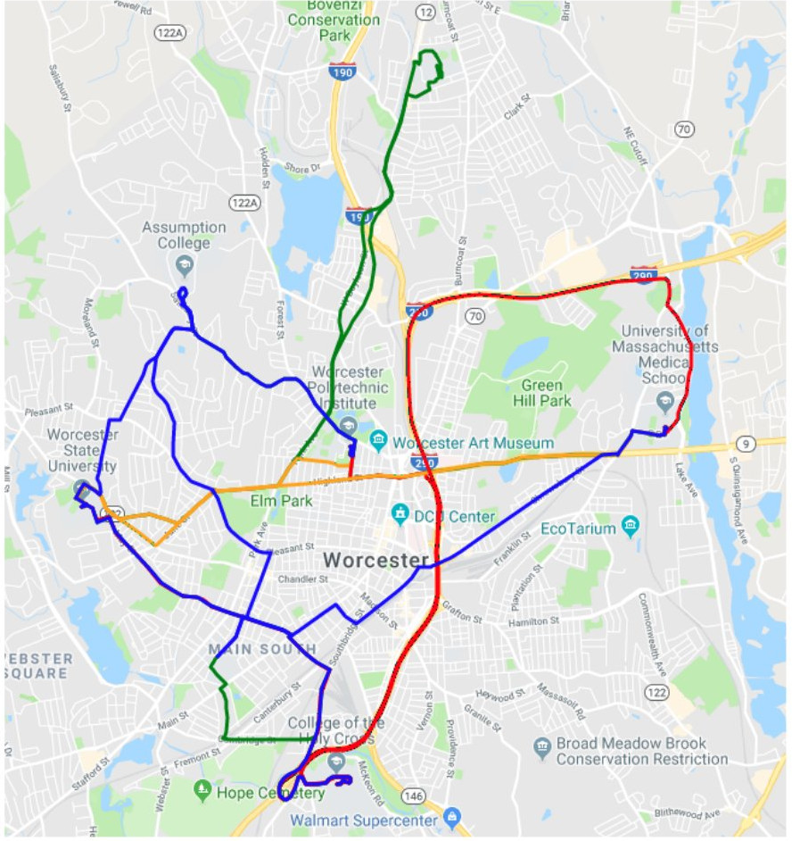

# Worcester Bus Plan
This is our project for the November 2018 Rocket Hackathon at Worcester
Polytechnic Institute (WPI). This project was the **2nd place winner, with a cash
reward.**

## Problem and Solution Summary
In this hackathon, the mayor of Worcester
approached WPI & Rocket Software to fix problems in Worcester. We were given
three problems:

1. Improving traffic patterns at Kelly Square - particularly in advance of 
   the new ballpark
2. The commuter rail is great, but there's a dearth of cost-effective, efficient
   and timely transportation to travelers workplaces or campuses. 
3. How can Worcester attract more students to the downtown area? 

We decided that we wanted to tackle problems 1 & 2. We realized that the main
reason why we, as WPI students, don't go downtown is because we didn't have a
cost-effective way to visit the city. Using Uber (which is really the only
option), it costs $10 to commute both back and from downtown. That means a trip
downtown is a minimum of $20 ($25 - 30, assuming some food costs). 

We thought a good solution for this would be if Worcester had better public
transportation. This would offer a cost-effective way to enjoy all of the
different parts of Worcester. This solution also hits problem 2, so that's
always a win!

Our idea was to optimize the bus routes in Worcester. We came up with a list of
attractions that we (as college students) would visit, as well as the colleges
in Worcester.

## Execution Direction

### Environment
All of the analysis for this project is run in a Docker instance. To run the web
app, you will need a python environment with `Flask` installed. **TODO**: Create
a Docker environment for the webapp as well.

### Analysis
To run the jupyter notebook which has all of our analysis for the project,
simply execute `./jupyter.sh`. This will then open up a jupyter notebook
instance at `http://localhost:8900`. Open the address in a browser and you
should be greeted with a screen asking for a password. To get the password, run
`docker logs woobusplan`, and copy the token. Once you are in the notebook, you
can simply run `Optimla Routes.ipynb`

### Web App
To run the web app, go into the `webapp` folder, and run `python main.py`

## Techniques / Technologies Used

### Google Distance Matrix API
We used Google's Distance Matrix API to get the amount of time that it takes to
travel from one location to anther. This was integral to creating the adjacency
matrix when trying to find the optimal path.

A problem that we had with this API is the number of elements that we were
pushing to it. As we didn't pay for this API, we had to actually implement a way
to page the API so that we can still get all of the data, but without doing one
large request. 

### Prim's Algorithm
There are two ways to treat this problem. Either we convert this to a Traveling
Salesmen Problem or we create a Minimum Spanning Tree (MST). We thought the MST
would be a better idea because it would reduce the time inter-stop, especially
for different bus lines, which will be discussed a bit later. 

The following is the tree that Prim's generates. One thing to note is that the
headers didn't fit, so just imagine that the row headers were transposed onto
the columns.

### k-Means Clustering
Prim's is great an all, but it will only create a MST. While that is what we are
looking for, that is really only optimized under the assumption that one bus
will be running. It doesn't take into account the fact that downtown will need a
lot more buses than, say, the hospital.

We used `k-Means` to determine the best clusters for different bus routes.
Because we were dealing with non-standard dissimilarity values, we had to
implement `k-Means` from scratch.

We initialized `k-Means` with the furthest stops in the North, South, East, and
West directions and let the algorithm do the rest. We made sure to include Union
Station in every route. 

The following are the results of the clustering. The points correlate to their
relative positions.

### Google Directions Services
We used the Google Directions Services to visualize the optimal routes. As both
we and the services use the Google Distance Matrix API, the paths that we use
and the paths that we map are the same.

## Results
The following are the generated routes. This didn't take into account the
clustering.

The following are the generated routes with clustering:

## Next Steps
As you can probably see, the clustered routes ended up looking a little funky.
We believe this is an issue with the fact that we aren't paying for Google
Direction Services, and that is causing rendering issues. 

We have outlined more things that we would like to do with more time and
resources in the presentation.

## Presentation
The slidedeck that we presented in the hackathon can be found at
[WooBus.pdf](WooBus.pdf)
